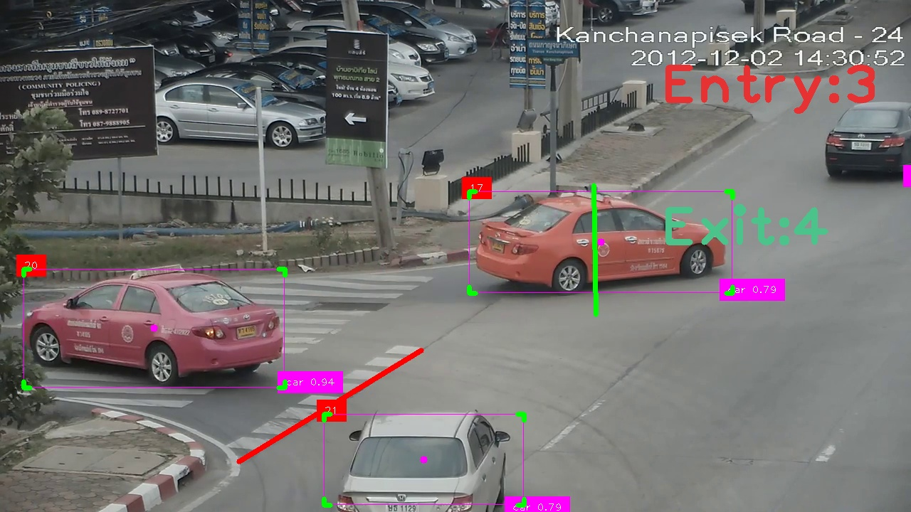

# Count Number Of Vehicles Exiting and Entering an Intersection

Hi my name is `Moses Daudu`

In this repo, You will see how I counted different vehicles at two seperate locations

## Step 1: Install all requirements
`pip install -r requirements.txt`

## Step 2: Run the `python` file
`1python traffic_count.py`

Contact Moses at `mosesdaudu001@gmail.com` for adjustments to suit your needs.

### Side Notes:
1. I used masks to improvve the efficiency of the detector. But as I'm sure that you are already aware that masks are specific to the video and so you would need your own customly made masks.
2. I want to add the functionality to save the video and also a json file that containes the final nunmber of vehicles counted for both ways.
3. I want to dockerize this file

